# 📊 VISUAL ARCHITECTURE DIAGRAMS

This document contains visual diagrams to help you understand the backend architecture.

> **Note:** These diagrams use Mermaid syntax. They render automatically in GitHub, VS Code (with Markdown Preview), and many other Markdown viewers.

---

## 🏗️ 1. High-Level System Architecture

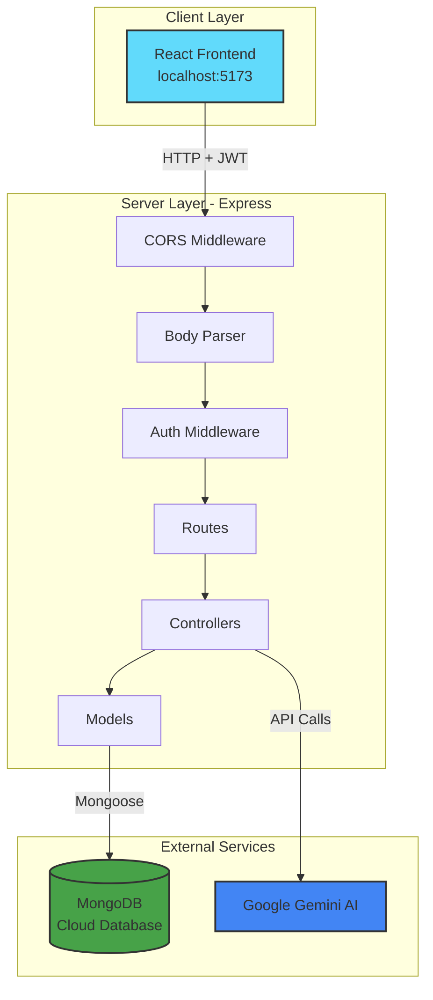

---

## 🔄 2. Request Flow Diagram

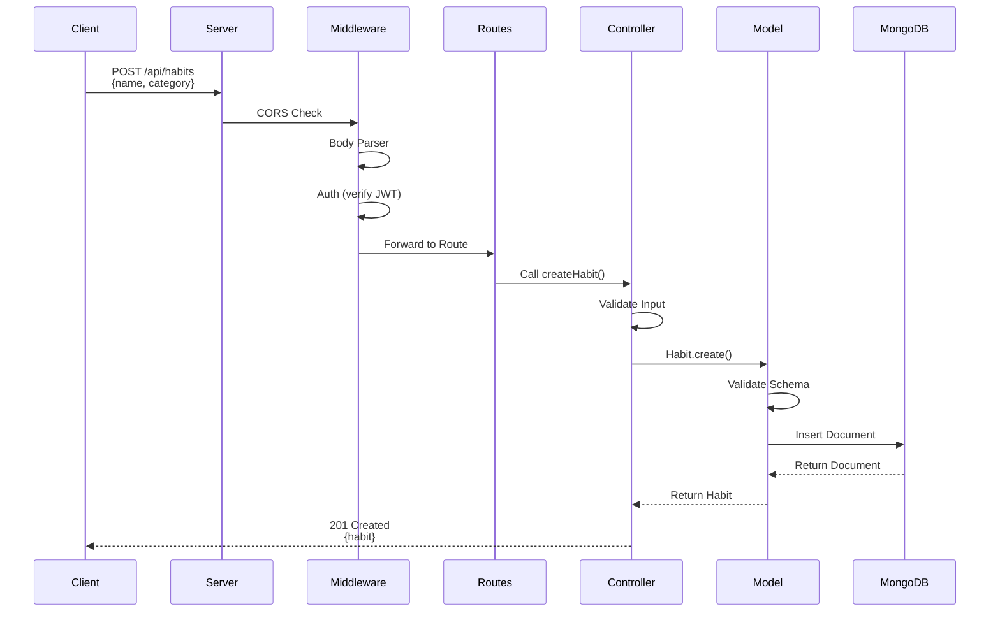

---

## 📁 3. Folder Structure Tree

```mermaid
graph TD
    A[backend/] --> B[config/]
    A --> C[controllers/]
    A --> D[middleware/]
    A --> E[models/]
    A --> F[routes/]
    A --> G[scripts/]
    A --> H[utils/]
    A --> I[server.js]
    A --> J[.env]
    A --> K[package.json]

    B --> B1[db.js]

    C --> C1[authController.js]
    C --> C2[habitController.js]
    C --> C3[logController.js]
    C --> C4[aiController.js]

    D --> D1[auth.js]
    D --> D2[errorHandler.js]

    E --> E1[Users.js]
    E --> E2[Habits.js]
    E --> E3[HabitsLog.js]
    E --> E4[AIinsight.js]

    F --> F1[auth.js]
    F --> F2[habits.js]
    F --> F3[logs.js]
    F --> F4[ai.js]

    G --> G1[seed.js]

    H --> H1[aiService.js]
    H --> H2[dateHelper.js]

    style I fill:#ff6b6b,stroke:#333,stroke-width:3px
    style B1 fill:#4ecdc4,stroke:#333,stroke-width:2px
    style E1 fill:#95e1d3,stroke:#333,stroke-width:2px
    style E2 fill:#95e1d3,stroke:#333,stroke-width:2px
    style E3 fill:#95e1d3,stroke:#333,stroke-width:2px
    style E4 fill:#95e1d3,stroke:#333,stroke-width:2px
```

---

## 🗄️ 4. Database Schema Relationships

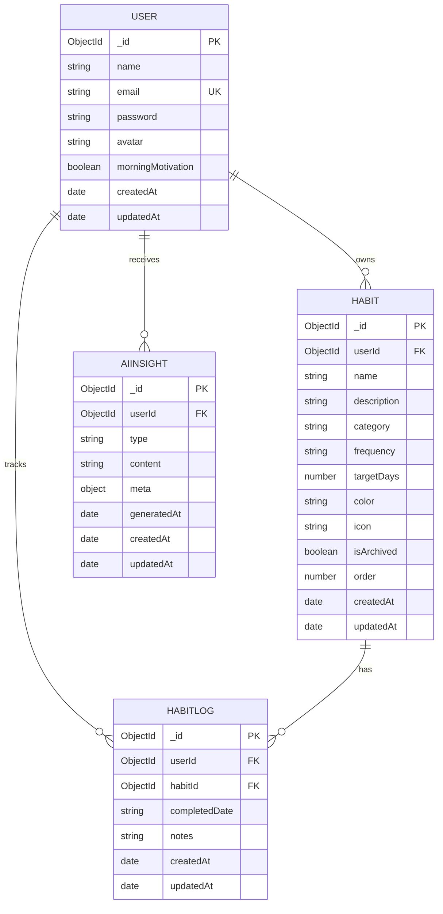

---

## 🔐 5. Authentication Flow

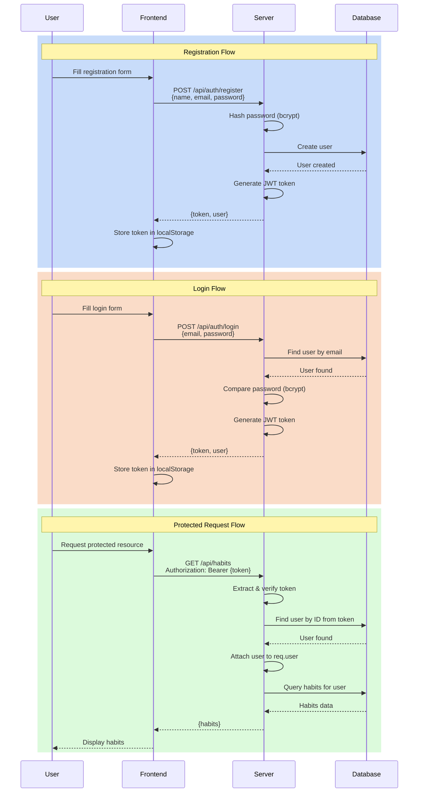

---

## 🎯 6. Middleware Chain

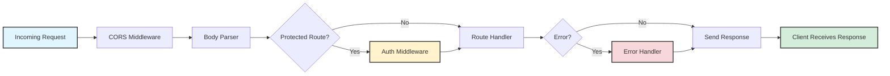

---

## 📊 7. Controller → Model → Database Flow

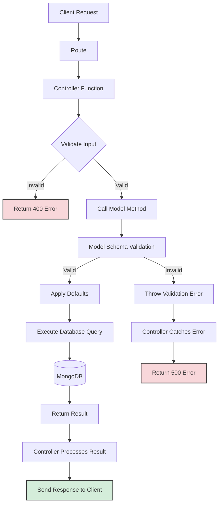

---

## 🔄 8. Habit Creation Flow (Detailed)

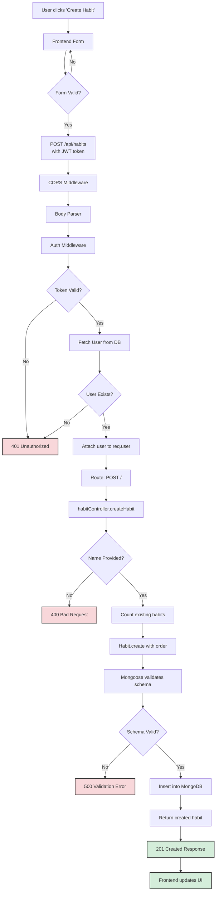

---

## 🧩 9. API Endpoints Map

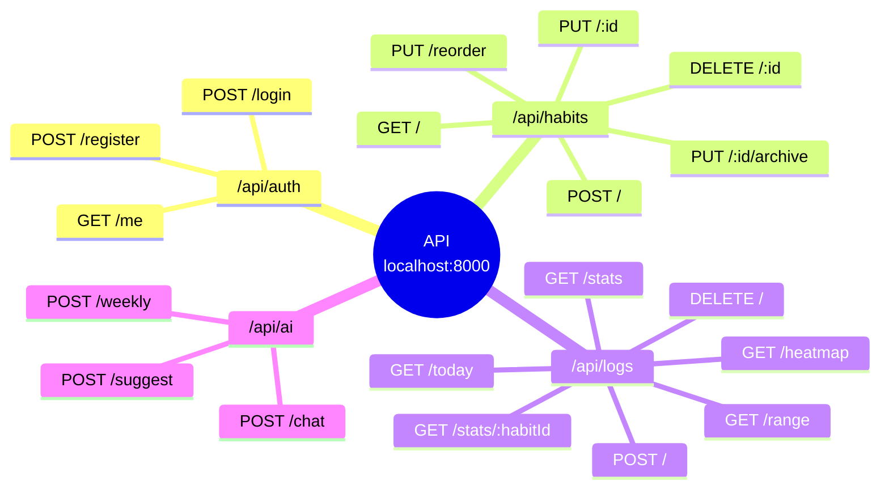

---

## 🔒 10. Security Layers

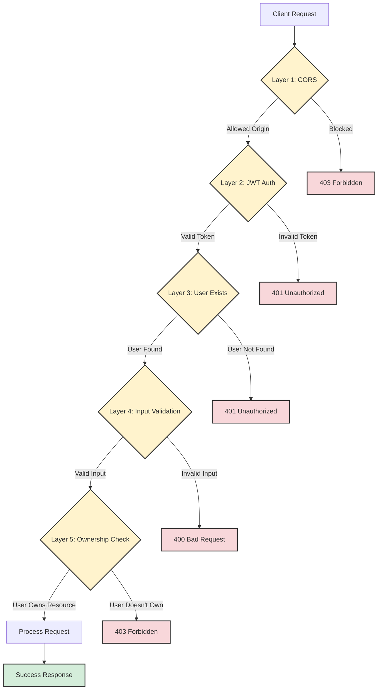

---

## 📈 11. Streak Calculation Logic

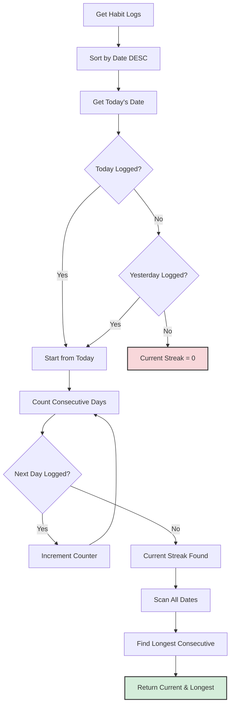

---

## 🤖 12. AI Integration Flow

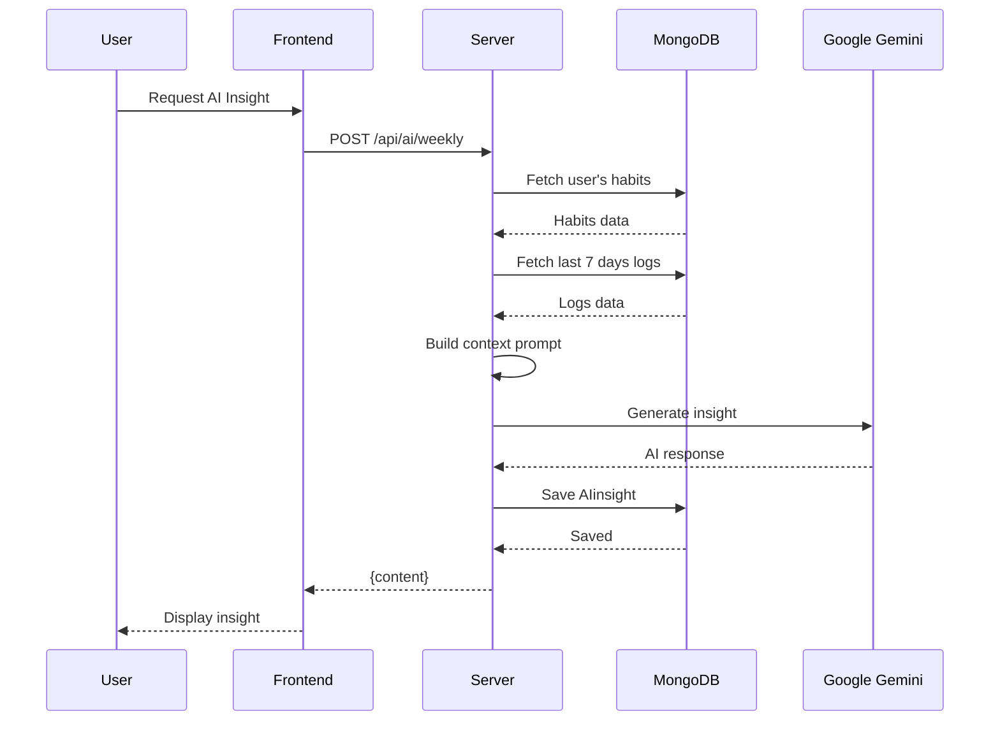

---

## 🎨 13. MVC Pattern in Your App

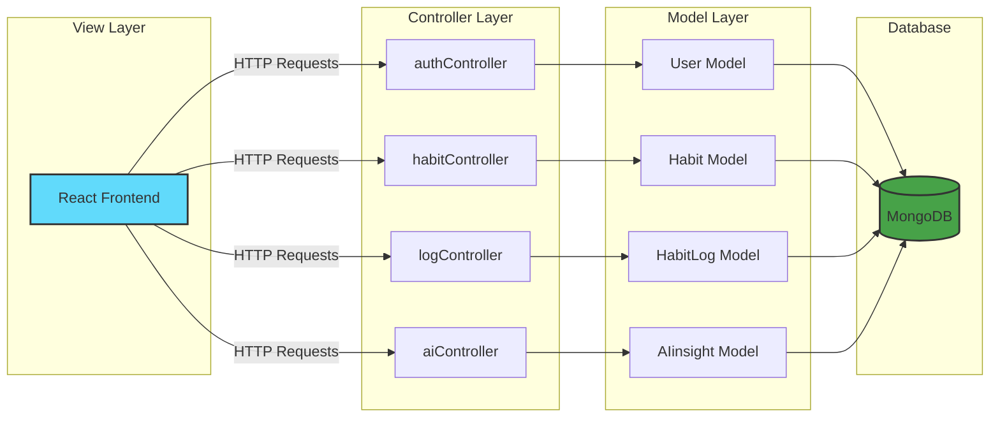

---

## 🔄 14. Complete User Journey

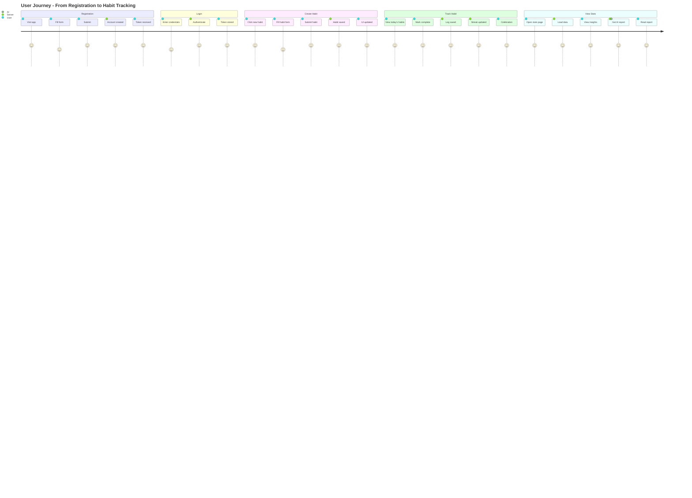

---

## 📦 15. Dependency Graph

```mermaid
graph TD
    A[server.js] --> B[config/db.js]
    A --> C[routes/*]
    A --> D[middleware/errorHandler.js]

    C --> E[middleware/auth.js]
    C --> F[controllers/*]

    E --> G[models/Users.js]

    F --> G
    F --> H[models/Habits.js]
    F --> I[models/HabitsLog.js]
    F --> J[models/AIinsight.js]
    F --> K[utils/dateHelper.js]
    F --> L[utils/aiService.js]

    G --> M[mongoose]
    H --> M
    I --> M
    J --> M

    E --> N[jsonwebtoken]
    G --> O[bcryptjs]
    K --> P[date-fns]
    L --> Q[@google/genai]

    style A fill:#ff6b6b,stroke:#333,stroke-width:3px
    style M fill:#880000,stroke:#333,stroke-width:2px,color:#fff
    style N fill:#880000,stroke:#333,stroke-width:2px,color:#fff
    style O fill:#880000,stroke:#333,stroke-width:2px,color:#fff
    style P fill:#880000,stroke:#333,stroke-width:2px,color:#fff
    style Q fill:#880000,stroke:#333,stroke-width:2px,color:#fff
```

---

## 🎯 How to Use These Diagrams

1. **GitHub/GitLab**: These diagrams render automatically when you view this file
2. **VS Code**: Install "Markdown Preview Mermaid Support" extension
3. **Online**: Copy the mermaid code to https://mermaid.live/
4. **Documentation**: Reference these diagrams when explaining architecture

---

## 📚 Diagram Legend

| Symbol      | Meaning              |
| ----------- | -------------------- |
| Rectangle   | Process/Component    |
| Diamond     | Decision Point       |
| Cylinder    | Database             |
| Circle      | Start/End Point      |
| Arrow       | Data Flow            |
| Dotted Line | Optional/Conditional |

---

**Related Documents:**

- [PART-7-Architecture-Overview.md](./PART-7-Architecture-Overview.md) - Detailed architecture explanation
- [README.md](./README.md) - Documentation index
